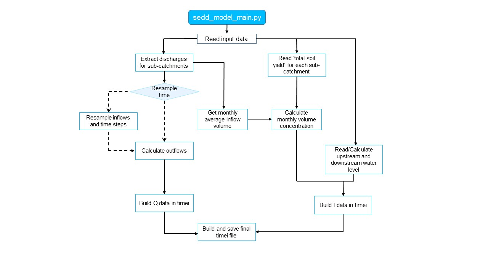

# BC_calc_SSIIM

Routines to calculate boundary conditions for SSIIM2 numerical software

## Requirements

The algorithms are written in
Python3 ([get installation instructions](https://hydro-informatics.com/python-basics/pyinstall.html)) and built on the
following external libraries: *numpy*, *pandas*

In addition, the following standard Python libraries are used: *glob*, *os*, *sys*

## Input Data

The below-listed input arguments and data have to be provided to run the algorithm. The input arguments are variables
that can be set in `config.py`.

| Input argument             | Type             | Description                                                                                                                                                                                                                                    |
|----------------------------|------------------|------------------------------------------------------------------------------------------------------------------------------------------------------------------------------------------------------------------------------------------------|
| `q_path`                   | *string*         | File path (PATH/name.b16) where the results from the WaSim results are stored (see below for format)                                                                                                                                           |
| `q_storage`                | *string*         | File path (PATH/name.txt) where the storage volume to water level corelation is stored                                                                                                                                                         |
| `sy_folder`                | *string*         | Folder path (PATH/folder name) where the .txt files with the total sediment yield data for each sub-catchment is found                                                                                                                         |
| `catchment_order`          | *list of string* | Names of sub-catchments to consider, and the .txt files for each subcatchment must have the catchment name in the file name                                                                                                                    |
| `sediment_density`         | *float*          | Sediment density (kg/m3) to consider                                                                                                                                                                                                           |
| `turbine_capacity`         | *float*          | Maximum flow (q) that can pass through the turbines                                                                                                                                                                                            |
| `time_interval`[^1]        | *integer*        | Value that indicates the time frequency to use: 0 to keep the input data frequency, 1 for a daily frequency, 2 for a monthly frequency                                                                                                         |
| `wl_threshold`             | *array*          | Target water level for each month in the reservoir. The array has to have 12 water levels in meter (see below for logic)                                                                                                                       |
| `target_wl_upper_boundary` | *integer*        | The upper boundary relative to the target water level (see below for logic)                                                                                                                                                                    |
| `target_wl_lower_boundary` | *integer*        | The lower boundary relative to the target water level as a negative integer (see below for logic)                                                                                                                                              |
| `target_wl_maximum`        | *integer*        | The maximum water level the reservoir can hold  (see below for logic)                                                                                                                                                                          |
| `plot_outflow_data`        | *boolean*        | A mass balance plot will be safed to the results folder as massbalance.png when set true. It displays inflow, turbine capacity and overflow over time                                                                                          |
| `plot_water_level`         | *boolean*        | A water level plot will be safed to the results folder as waterlevel.png when set true. It shows the water level over time                                                                                                                     |
| `plot_fig_size`            | *array*          | A two integer array [width, height] for the size of the plots. It is recommended to have a larger width when handling large time frames to improve the quality of the plots. Large figures might break due to memory (use no bigger than 150). |
| `restrict_timei_date`      | *boolean*        | Reduces the timei output file to the time frame of timei_date_start and timei_date_end when set true                                                                                                                                           |
| `timei_date_start`         | *string*         | The start date in string format for the timeframe ()                                                                                                                                                                                           |
| `timei_date_end`           | *string*         | The end date in string format for the timeframe                                                                                                                                                                                                |
| `results_folder`           | *string*         | Path of the main result folder                                                                                                                                                                                                                 |

[^1]:more frequencies can be added by the user

### WaSim results format

The WaSim results must be in .b16 file format, and must contain the following information, in the following order (each
column):
| Column | Name | Data |
|------- | ---- | ---- |
| 1 | YY | Year (int) |
| 2 | MM | Month (int) |
| 3 | DD | Day (int) |
| 4 | HH | Hour (int) |
| 5 | 1 | Inflow (m3/s) - not used |
| 6 | 2 | Inflow (m3/s) for Zalli sub-catchment |
| 7 | 3 | Inflow (m3/s) for Skebices sub-catchment |
| 8 | 4 | Inflow (m3/s) for Holta sub-catchment |
| 9 | 5 | Inflow (m3/s) for Devoll sub-catchment |

### Seasonal water level

The water level is kept close to the target water level given in wl_threshold. The following logic is applied:
| Water level | Mass balance | Description |
| ----------- | ------------ | ----------- |
| `current_wl` < `target_wl` + `target_wl_lower_boundary` | Turbine = 0, Overflow = 0 | All inflowing water is stored in
the reservoir |
| `target_wl` + `target_wl_lower_boundary` < `current_wl` < `target_wl` | Turbine = Inflow/2 (<=turbine_capacity),
Overflow = 0 | The turbine runs with half of the inflowing water but at maximum at turbine_capacity |
| `target_wl` < `current_wl` < `target_wl` + `target_wl_upper_boundary` | Turbine = Inflow (<=turbine_capacity),
Overflow = 0 | The turbine runs with the inflowing water but at maximum at turbine_capacity |
| `target_wl` + `target_wl_upper_boundary` < `current_wl` < `target_wl_maximum` | Turbine = turbine_capacity, Overflow =
0 | The turbine runs at full capacity (turbine_capacity) |
| `target_wl_maximum` <= `current_wl` | Turbine = turbine_capacity, Overflow = Inflow - Turbine (>=0) | The turbine runs
at full capacity (turbine_capacity) and all excess inflow is dumped at the overflow |

Important to note: Using seasonal water level with the dynamic logic above combined with a higher `time_interval` will
produce bad results and should therefore not be used. It is only recommended to use `time_interval` = 0.

### Total sediment yield data format

There must be a .txt file with the sediment loss and sediment yield data for each sub-catchment to consider, and the
file name must contain the name of the sub-catchment as stated in the "catchment_order" variable. The .txt file is the
result from the 'Sediment_Loacd_Calculation" codes [https://github.com/KMouris/Sediment_Load_Calculation], where the
first column's name is "Date", and has the date in YYYYMM format, and the column with the totalsediment yield for the
given sub-catchment is found under the columns with name "Total Sediment Yield [ton/month]".

## Code Diagram

