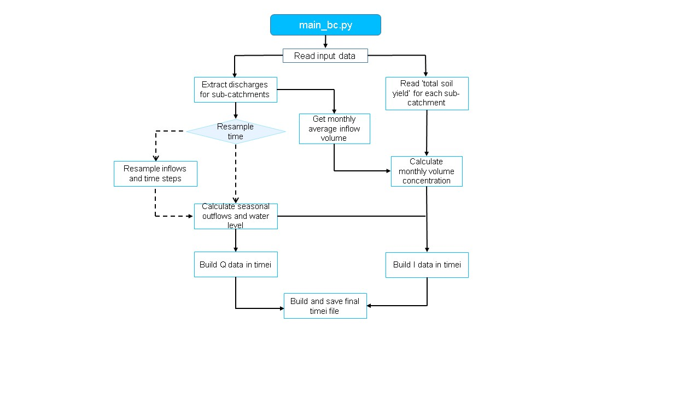

# BC_calc_SSIIM
Routines to calculate boundary conditions for SSIIM2 numerical software

## Requirements

The algorithms are written in Python3 ([get installation instructions](https://hydro-informatics.com/python-basics/pyinstall.html)) and built on the following external libraries: *numpy*, *pandas*

In addition, the following standard Python libraries are used: *glob*, *os*, *sys*

## Input Data

The below-listed input arguments and data have to be provided to run the algorithm. The input arguments are variables that can be set in `config.py`.

| Input argument | Type | Description                                                                                                                      |
|----------------|------|----------------------------------------------------------------------------------------------------------------------------------|
|`q_path`| *string* | File path (PATH/name.b16) where the results from the WaSim results are stored (see below for format)                             |
|`sy_folder`| *string* | Folder path (PATH/folder name) where the .txt files with the total sediment yield data for each sub-catchment is found           |
|`turbine_capacity`| *float* | Maximum flow (q) that can pass through the turbines                                                                              |
|`time_interval`[^1]| *integer* | Value that indicates the time frequency to use: 0 to keep the input data frequency, 1 for a daily frequency, 2 for a monthly frequency |
|`upstream_wl`[^2]| *float* | Upstream water level to consider in the simulation (0 if a upstream WL is not needed as BC                                       |
|`downstream_wl`[^2]| *float* | Downstream water level to consider in the simulation                                                                             |
|`catchment_order`| *list of strings* | Names of sub-catchments to consider, and the .txt files for each subcatchment must have the catchment name in the file name      |
|`sediment_density`| *float* | Sediment density (kg/m3) to consider                                                                                             |
|`results_path`| *string* | Path of the main result folder                                                                                                   |

[^1]:more frequencies can be added by the user
[^2]: These water levels are taken as constant for all time steps. If user wants to use time-dependent water levels, the code must be modified. 

### WaSim results format
The WaSim results must be in .b16 file format, and must contain the following information, in the following order (each column): 
| Column | Name | Data |
|------- | ---- | ---- |
| 1 | YY | Year (int) |
| 2 | MM | Month (int) |
| 3 | DD | Day (int) |
| 4 | HH | Hour (int) |
| 5 | 1 | Inflow (m3/s) - not used  |
| 6 | 2 | Inflow (m3/s) for Zalli sub-catchment |
| 7 | 3 | Inflow (m3/s) for Skebices sub-catchment |
| 8 | 4 | Inflow (m3/s) for Holta sub-catchment |
| 9 | 5 | Inflow (m3/s) for Devoll sub-catchment |

### Total sediment yield data format

There must be a .txt file with the sediment loss and sediment yield data for each sub-catchment to consider, and the file name must contain the name of the sub-catchment as stated in the "catchment_order" variable. The .txt file is the result from the 'Sediment_Loacd_Calculation" codes [https://github.com/KMouris/Sediment_Load_Calculation], where the first column's name is "Date", and has the date in YYYYMM format, and the column with the totalsediment yield for the given sub-catchment is found under the columns with name "Total Sediment Yield [ton/month]". 

## Code Diagram

